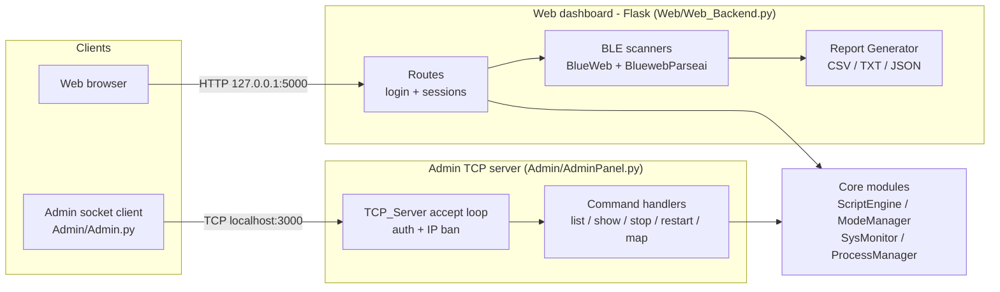

# Server-Framework

> Unified control center for modes, processes, sensors & servers.

A Python multi-mode **server management and control framework**. It starts, stops,
renames, restarts and monitors arbitrary scripts ("modes") in detected Linux
terminals, tracks their PIDs/lifetimes via `psutil`, auto-manages a JSON path
registry with per-component logging, and reads system sensors (CPU, memory,
disk, temperature, battery, fans, network, users). It exposes several control
surfaces — a socket admin panel, a Flask web dashboard, an FTP server, and now a
single branded **CLI control center**: `dashboard.py`.

## Architecture

The two live control surfaces — the **Admin TCP server** and the **Flask web
dashboard** — run independently and both drive the same `Core/` modules. The
admin server accepts a client, authenticates it (three failures ban the IP),
then dispatches text commands to handlers; the web dashboard serves a browser UI
whose Bluetooth pages fan out to the BLE scanners and pipe results through the
report generator.



<!--  -->

## The idea

Everything hangs off a small set of `Core/` modules that discover the project
root, keep a machine-portable path registry (`Core/Paths.json`), and fan work out
to the specialized surfaces. `dashboard.py` is the front door that drives the real
modules directly.

```
                        python3 dashboard.py
                                 │
                    ┌────────────┴────────────┐
                    │   dashboard.py (root)    │  branded CLI, EOF-safe menu + --demo
                    └────────────┬────────────┘
        ┌───────────────┬────────┼─────────┬──────────────────┐
        ▼               ▼        ▼         ▼                  ▼
  SysMonitor        Modes +    Settings/  Launchers        Logs/
  .Sensor           Engine     Directory  (print only)     (tail newest)
  CPU/mem/disk/     terminals, Manager    Admin socket ─┐
  temp/uptime       registry,  Paths.json Flask web ────┤ started as
                    show_running          FTP server ───┘ separate procs

  Core/ modules use flat imports (`from Log import Logs`) and only resolve with
  Core/ (and Web/, Admin/) on sys.path — every entry point injects that itself.
```

The socket admin panel additionally speaks a tiny text protocol:

```
  client                         AdminPanel (TCP, default localhost:3000)
    │   "<username>,<password>"          │
    │ ─────────────────────────────────▶│  authenticate
    │   "[+] Authentication successful!" │  (3 failures  →  IP ban, banned_ips.json)
    │ ◀─────────────────────────────────│
    │   "list" / "show" / "info" / ...   │
    │ ─────────────────────────────────▶│  command loop (text responses)
    │   "exit"                           │
    │ ─────────────────────────────────▶│  disconnect
```

## Features

- **One branded CLI control center** (`dashboard.py`) with a `rich` UI and a clean
  plain-ANSI fallback when `rich` is not installed.
- **System status** — full sensor sweep through `Core/SysMonitor.Sensor`
  (uptime, CPU, memory, disk, component temperatures).
- **Modes & processes** — detected terminals (`Core/Settings`), managed modes
  (`Core/Modes.ModeManager`), the process registry (`ProcessesLab.json`), and the
  live tracked-script view (`Core/Engine.ScriptEngine.show_running`). The dashboard
  never spawns terminals; it inspects the registry/status only.
- **Path registry** — resolved project paths from `Core/Paths.json` via
  `Core/Settings.Path_Settings` + `Core/DirectoryManager`.
- **Server launchers** — prints the exact commands to start the Admin socket
  server, the Flask web dashboard, and the FTP server (never blocks).
- **Recent logs** — lists `Logs/` newest-first and tails the most recent file.
- **Example client/server scripts** for TCP/UDP/HTTP/WebSocket/FTP under `Other/`.

## Quickstart

```bash
pip install -r requirements.txt

python3 dashboard.py          # interactive, branded menu loop
python3 dashboard.py --demo   # scripted, non-interactive showcase (exits 0)
```

Representative slice of real `--demo` output (trimmed):

```
╔══════════════════════════════════════════════════════════════════╗
║    SERVER-FRAMEWORK                                                ║
║    Unified control center for modes, processes, sensors & servers ║
╚══════════════════════════════════════════════════════════════════╝
╭──────────────── live snapshot ────────────────╮
│   Host  zedx · Linux 6.17.0-35-generic         │
│    CPU  0%                                      │
│ Memory  38%  (11.7/30.6 GB)                    │
│ Disk /  71%  (320/468 GB)                      │
│ Uptime  7:37:20                                │
╰────────────────────────────────────────────────╯
──────────── System status · Core/SysMonitor.Sensor ────────────
[*] System Uptime: 7:37:21
[*] CPU Usage: 1.5%
[*] Memory Usage:
    ├── Total Memory: 30.57 GB
    ├── Used Memory: 11.73 GB
    ├── Memory Usage: 38.4%
✓ Sensor sweep complete
─────────── Modes & processes · Core/Modes + Core/Engine ───────────
› Platform: Linux
› Detected terminals: terminator
  #   Managed mode
  1   tests
  2   Web
  3   Test
  4   Other
› Process registry (ProcessesLab.json): 0 tracked process(es)
✓ 5 mode(s) detected, 0 process(es) in registry
─────────── Server launchers · copy/paste to start ───────────
  Admin socket server │ python3 Admin/AdminPanel.py
  Flask web dashboard │ python3 Web/Web_Backend.py --host 127.0.0.1 --port 5000
  FTP file server     │ python3 Other/FTP/ftp_server.py --path ./shared ...
───────────────────────── Demo summary ─────────────────────────
› modes_detected: 5
› terminals_detected: 1
› processes_tracked: 0
› project_root: /home/user/Projects/Server-Framework
› log_files: 9
✓ Demo complete — all features exercised, no servers left running.
```

`python3 dashboard.py --demo --json` prints the summary block as JSON instead.

## Usage

```bash
# Canonical control center
python3 dashboard.py            # interactive menu
python3 dashboard.py --demo     # non-interactive showcase, exits 0
python3 dashboard.py --json --demo

# Socket admin server (default localhost:3000) + client
python3 Admin/AdminPanel.py
python3 Admin/Admin.py

# Flask web dashboard (safe defaults: 127.0.0.1:5000, debug OFF)
python3 Web/Web_Backend.py --host 127.0.0.1 --port 5000   # add --debug for local dev only

# System sensor snapshot (library entry point)
python3 Core/SysMonitor.py

# FTP file server / client
python3 Other/FTP/ftp_server.py --path ./shared --host 127.0.0.1 --port 2121
python3 Other/FTP/ftp_client.py --host 127.0.0.1 --port 2121 --username test --password test
```

Library API (with `Core/` on `sys.path`, as `dashboard.py` and `tests/conftest.py` arrange):

```python
from SysMonitor import Sensor
from Modes import ModeManager
from Settings import Path_Settings, Server_Settings

Sensor().Memory_Checker()                       # print a memory snapshot
ModeManager().list_modes()                      # -> ['tests', 'Web', 'Test', 'Other', ...]
Server_Settings.get_available_terminals("Linux")
Path_Settings().checkpath("Server-FrameworkCore")
```

## Protocol

### Socket admin panel (`Admin/AdminPanel.py`)

Plain TCP text protocol over the framework's `TCP_Server`:

1. **Handshake / auth:** client connects and sends `"<username>,<password>"`.
   On success the server replies `"[+] Authentication successful!"` then streams a
   banner. On failure it replies an auth-failed message; **3 failed attempts** ban
   the client IP (persisted to `Admin/banned_ips.json`).
2. **Command loop:** client sends a command line; the server responds with text.
   Commands: `list`, `map`, `show`, `info`, `stop`, `stop_all`, `rename`,
   `restart`, `help`, `read`, a numeric mode index, or `exit`.

### FTP server (`Other/FTP/ftp_server.py`, `Core` `Settings.FTP_Server`)

Standard FTP (RFC 959) via `pyftpdlib`: `USER`/`PASS` login (default `test`/`test`),
passive-mode data channel, `STOR`/`RETR` for upload/download, optional 30 KB/s
throttle. Covered by a real loopback transfer test in `tests/test_ftp.py`.

### Status codes referenced

| Protocol | Code | Meaning |
| --- | --- | --- |
| FTP | 230 | login successful |
| FTP | 530 | login failure |
| FTP | 550 | permission denied / not found |
| HTTP (`Other/Chats/http`) | 200 | OK |
| HTTP (`Other/Chats/http`) | 400 | bad request |

## Testing

```bash
python3 -m pytest -q
```

Current status: **33 passed**. The suite (`tests/`) covers pure logic, an import
smoke test for every library module, a loopback FTP handshake + file-transfer test
on an ephemeral port, and the `dashboard.py` contract (`--demo` exits 0, `--help`
works, and non-TTY stdin exits promptly with bounded output).

## Project layout

```
Server-Framework/
├── dashboard.py          # canonical CLI control center (start here)
├── README.md
├── requirements.txt
├── Core/                 # framework core (flat-imported modules)
│   ├── SysMonitor.py     #   Sensor: CPU/mem/disk/temp/battery/fans/net
│   ├── Modes.py          #   ModeManager: detect/list modes
│   ├── Engine.py         #   ScriptEngine: start/stop/track processes
│   ├── Settings.py       #   Path_Settings, Server_Settings, *_Server helpers
│   ├── DirectoryManager.py  # path registry + ProcessManager
│   ├── Log.py            #   per-component logging
│   └── Paths.json        #   auto-managed, machine-portable path registry
├── Admin/                # AdminPanel.py (socket server), Admin.py (client), Dashboard.py
├── Web/                  # Web_Backend.py (Flask) + BLE / sysinfo helpers, templates
├── Other/                # example TCP/UDP/HTTP/WebSocket + FTP client/server scripts
├── Logs/                 # per-component .log files
└── tests/                # pytest suite (logic, smoke, FTP, dashboard contract)
```

## Requirements / optional dependencies

- Python 3.11+ (developed and tested on 3.13, Linux). Install with
  `pip install -r requirements.txt`.
- **Optional** — features degrade gracefully via lazy imports when absent:

| Package | Feature |
| --- | --- |
| `rich` | branded `dashboard.py` UI (plain-ANSI fallback otherwise) |
| `plyer` | desktop notifications (`Core/SysMonitor.py`) |
| `bleak` | BLE scanning (`Web/BlueWeb.py`, `Web/BluewebParseai.py`) |
| `openai` | AI BLE vulnerability reports (`Web/BluewebParseai.py`) |
| `scapy`, `netifaces`, `networkx`, `matplotlib` | network discovery / mapping (`Test/test1.py`) |

`Core/Paths.json` is a machine-specific registry auto-regenerated from the detected
project root on startup (`Core/Emergency.py`), so the project is portable across
machines.
